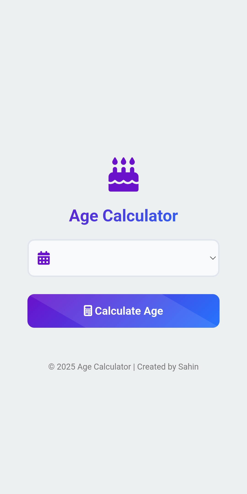

# Age Calculator

A simple and intuitive web-based age calculator that allows users to calculate their exact age in years, months, and days based on their date of birth.

## 🌟 Features

- **Accurate Age Calculation**: Calculate exact age in years, months, and days
- **User-Friendly Interface**: Clean and responsive design that works on all devices
- **Real-time Calculation**: Instant results as soon as you enter your birth date
- **Multiple Date Formats**: Supports various date input formats
- **Responsive Design**: Works seamlessly on desktop, tablet, and mobile devices
- **Cross-browser Compatibility**: Compatible with all modern web browsers

## 🚀 Demo

[Live Demo](https://lifeclockage.netlify.app/) 

## 📸 Screenshots



## 🛠️ Technologies Used

- **HTML5**: For the structure and layout
- **CSS3**: For styling and responsive design
- **JavaScript**: For age calculation logic and interactivity
- **Bootstrap** *(if used)*: For responsive components
- **Font Awesome** *(if used)*: For icons

## 🎯 How It Works

1. **Enter Birth Date**: Input your date of birth using the date picker
2. **Automatic Calculation**: The calculator instantly computes your age
3. **Detailed Results**: View your age broken down into years, months, and days
4. **Additional Info**: *(If applicable)* See additional details like days lived, hours, minutes, etc.

## 📋 Installation & Usage

### Prerequisites
- A modern web browser
- No additional software required

### Local Setup
1. Clone the repository:
   ```bash
   git clone https://github.com/SahinShazi/Age-Calculator.git
   ```

2. Navigate to the project directory:
   ```bash
   cd Age-Calculator
   ```

3. Open `index.html` in your preferred web browser:
   ```bash
   # Using your default browser
   open index.html
   
   # Or using a specific browser
   google-chrome index.html
   firefox index.html
   ```

### Using GitHub Pages
1. Fork this repository
2. Go to Settings > Pages
3. Select source branch (usually `main` or `gh-pages`)
4. Your calculator will be live at `https://yourusername.github.io/Age-Calculator/`

## 📂 Project Structure

```
Age-Calculator/
│
├── index.html          # Main HTML file
├── style.css           # Main stylesheet
├── script.js           # Main JavaScript file
├── screenshot.jpg
└── README.md          # This file
```

## ⚙️ Features Breakdown

### Age Calculation
- Calculates exact age considering leap years
- Handles edge cases (e.g., birth on February 29th)
- Provides results in multiple formats

### User Interface
- Clean, modern design
- Intuitive date input
- Clear result display
- Responsive layout for all screen sizes

### Browser Support
- ✅ Chrome (Latest)
- ✅ Firefox (Latest)
- ✅ Safari (Latest)
- ✅ Edge (Latest)
- ✅ Opera (Latest)

## 🎨 Customization

You can easily customize the calculator by modifying:

- **Colors**: Update CSS variables in `styles/style.css`
- **Fonts**: Change font families in the CSS files
- **Layout**: Modify the HTML structure in `index.html`
- **Calculation Logic**: Update the JavaScript in `scripts/calculations.js`

## 🤝 Contributing

Contributions are welcome! Here's how you can help:

1. **Fork** the repository
2. **Create** a feature branch (`git checkout -b feature/amazing-feature`)
3. **Commit** your changes (`git commit -m 'Add some amazing feature'`)
4. **Push** to the branch (`git push origin feature/amazing-feature`)
5. **Open** a Pull Request

### Development Guidelines
- Follow consistent coding style
- Test your changes across different browsers
- Update documentation if needed
- Add comments to complex code sections

## 🐛 Bug Reports

If you encounter any bugs or issues, please [open an issue](https://github.com/SahinShazi/Age-Calculator/issues) with:
- Description of the bug
- Steps to reproduce
- Expected behavior
- Screenshots (if applicable)
- Browser and OS information

## 📄 License

This project is licensed under the MIT License - see the [LICENSE](LICENSE) file for details.

## 👨‍💻 Author

**Sahin Shazi**
- GitHub: [@SahinShazi](https://github.com/SahinShazi)
- Email: (sahin.enam10@gmail.com)
- LinkedIn: (https://www.linkedin.com/in/sahinenam?utm_source=share&utm_campaign=share_via&utm_content=profile&utm_medium=android_app)

## 🙏 Acknowledgments

- Inspiration from various age calculator implementations
- Icons provided by Font Awesome *(if used)*
- CSS framework by Bootstrap *(if used)*
- Special thanks to the open-source community

## 📈 Roadmap

- [ ] Add more detailed age breakdowns (hours, minutes, seconds)
- [ ] Implement age comparison between two dates
- [ ] Add zodiac sign calculation
- [ ] Include birthday countdown feature
- [ ] Add multiple language support
- [ ] Implement dark/light theme toggle

---

⭐ **Star this repository if you found it helpful!**